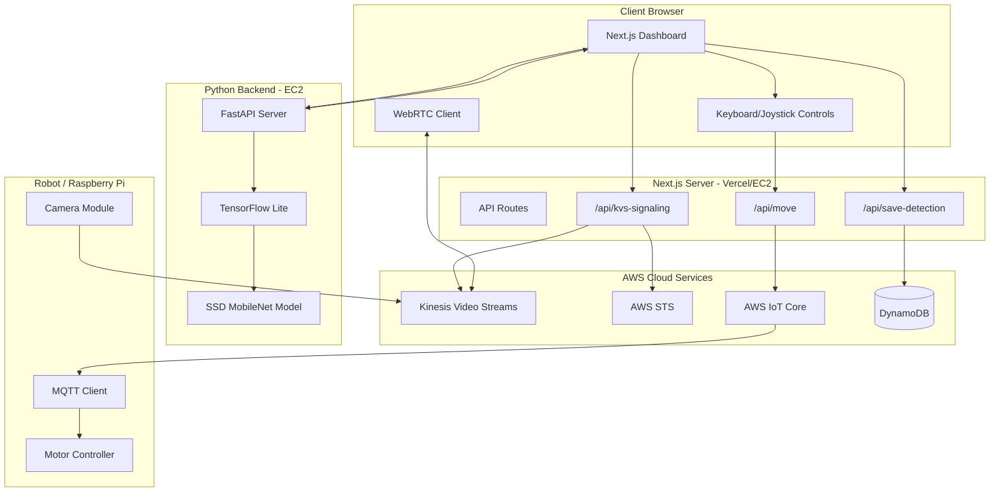
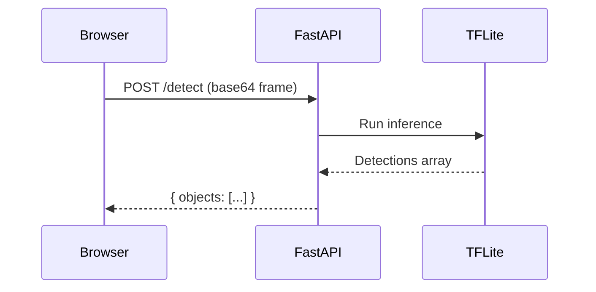
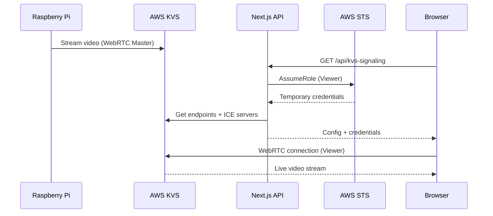
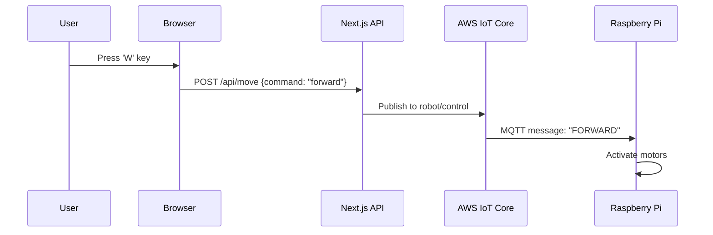

# 🏗️ PiBot Control Dashboard - Project Architecture

> A comprehensive IoT robotics control dashboard featuring real-time video streaming, AI object detection, and cloud-native services.

---

## 📋 Table of Contents

- [Technology Stack Overview](#-technology-stack-overview)
- [System Architecture](#-system-architecture)
- [Frontend Architecture](#-frontend-architecture)
- [Backend Architecture](#-backend-architecture)
- [AWS Services Integration](#-aws-services-integration)
- [API Endpoints](#-api-endpoints)
- [Data Flow](#-data-flow)
- [Project Structure](#-project-structure)

---

## 🛠️ Technology Stack Overview

| Layer | Technology | Purpose |
|-------|------------|---------|
| **Frontend** | Next.js 16 + React 19 | Server-side rendering, routing, UI |
| **Styling** | TailwindCSS 4 | Utility-first CSS framework |
| **State Management** | React Context API | IoT connection & detection state |
| **Video Streaming** | WebRTC + AWS KVS SDK | Real-time video from robot |
| **Backend (AI)** | Python + FastAPI + TensorFlow | Object detection processing |
| **Database** | AWS DynamoDB | Detection logs persistence |
| **IoT/MQTT** | AWS IoT Core | Robot control commands |
| **Video Infrastructure** | AWS Kinesis Video Streams | WebRTC signaling & streaming |
| **Authentication** | AWS STS (Assume Role) | Temporary credentials for viewers |

---

## 🔧 System Architecture



---

## 🎨 Frontend Architecture

### Framework & Core Libraries

| Package | Version | Purpose |
|---------|---------|---------|
| `next` | 16.1.1 | React framework with App Router |
| `react` | 19.2.3 | UI library |
| `tailwindcss` | 4.x | CSS framework |
| `lucide-react` | 0.562.0 | Icon library |
| `next-themes` | 0.4.6 | Dark/Light mode theming |
| `clsx` + `tailwind-merge` | - | Conditional class utilities |

### Component Structure

```
app/
├── components/
│   ├── VideoPlayer.tsx         # WebRTC video streaming + connection handling
│   ├── ObjectDetectionOverlay.tsx   # Bounding boxes on video
│   ├── DetectionLogic.tsx      # Detection state display
│   ├── Joystick.tsx            # Touch/mouse joystick control
│   ├── StatusCard.tsx          # System status cards
│   ├── ThemeProvider.tsx       # Dark/light mode provider
│   └── ThemeToggle.tsx         # Theme switch button
├── context/
│   ├── IoTConnectionContext.tsx    # MQTT connection state & commands
│   └── DetectionContext.tsx        # Object detection state
├── hooks/
│   └── use-keyboard-controls.ts    # WASD + Arrow key bindings
├── page.tsx                    # Main dashboard layout
└── layout.tsx                  # Root layout with providers
```

### Key Frontend Features

1. **WebRTC Video Streaming** (`VideoPlayer.tsx`)
   - Fetches signaling config from `/api/kvs-signaling`
   - Uses `amazon-kinesis-video-streams-webrtc` SDK
   - Manages peer connection and ICE candidates
   - Displays connection state (LIVE/CONNECTING/OFFLINE)

2. **Robot Control** (`IoTConnectionContext.tsx` + `use-keyboard-controls.ts`)
   - WASD and Arrow key bindings
   - Sends commands via `/api/move` endpoint
   - Commands: `FORWARD`, `BACKWARD`, `LEFT`, `RIGHT`, `STOP`

3. **Object Detection Overlay** (`ObjectDetectionOverlay.tsx`)
   - Renders bounding boxes on video
   - Shows detection confidence scores
   - Integrates with Python AI backend

---

## 🐍 Backend Architecture

### Python/FastAPI AI Service

| Package | Purpose |
|---------|---------|
| `FastAPI` | High-performance async API framework |
| `TensorFlow Lite` / `tflite-runtime` | Lightweight model inference |
| `NumPy` | Numerical operations |
| `Pillow` | Image processing |
| `uvicorn` | ASGI server |

### AI Model

- **Model**: SSD MobileNet V1 (TensorFlow Lite)
- **Task**: Real-time object detection
- **Output**: Bounding boxes, class labels, confidence scores

### Backend Flow



---

## ☁️ AWS Services Integration

### 1. AWS Kinesis Video Streams (KVS)

**Purpose**: Real-time WebRTC video streaming from robot camera

**Implementation** (`/api/kvs-signaling/route.ts`):
- Uses STS to assume a viewer role for temporary credentials
- Retrieves signaling channel endpoints (WSS + HTTPS)
- Fetches ICE server configuration for NAT traversal
- Returns credentials to client for WebRTC connection

**SDK Packages**:
- `@aws-sdk/client-kinesis-video`
- `@aws-sdk/client-kinesis-video-signaling`
- `@aws-sdk/client-sts`

---

### 2. AWS IoT Core

**Purpose**: MQTT messaging for robot motor control

**Implementation** (`/api/move/route.ts`):
- Publishes to topic: `robot/control`
- Payload: Plain text commands (`FORWARD`, `BACKWARD`, etc.)
- QoS: 1 (at least once delivery)

**SDK Packages**:
- `@aws-sdk/client-iot-data-plane`

**Message Flow**:
```
Browser → Next.js API → AWS IoT Core → MQTT → Raspberry Pi → Motors
```

---

### 3. AWS DynamoDB

**Purpose**: Persistent storage for detection logs

**Implementation** (`/api/save-detection/route.ts`):
- Table schema: `PK` (Camera ID), `SK` (Timestamp), `DetectedItems` (Set)
- Stores unique detected object classes
- Enables historical detection analysis

**SDK Packages**:
- `@aws-sdk/client-dynamodb`
- `@aws-sdk/lib-dynamodb`

---

### 4. AWS STS (Security Token Service)

**Purpose**: Generate temporary credentials for WebRTC viewers

**Implementation**:
- Backend assumes `PUBLIC_VIEWER_ROLE_ARN`
- Returns short-lived credentials (1 hour)
- Secures video stream access

---

## 🔌 API Endpoints

| Endpoint | Method | Description |
|----------|--------|-------------|
| `/api/kvs-signaling` | GET | Get WebRTC signaling config + temp credentials |
| `/api/move` | POST | Send robot movement command via MQTT |
| `/api/save-detection` | POST | Store detection results in DynamoDB |
| `/api/iot` | GET | Get IoT connection credentials (mock) |
| `/api/system-stats` | GET | Get system telemetry data |

### Request/Response Examples

**POST `/api/move`**
```json
// Request
{ "command": "forward" }

// Response
{
  "success": true,
  "message": "Executed command: forward",
  "topic": "robot/control",
  "payload": "FORWARD"
}
```

**POST `/api/save-detection`**
```json
// Request
{
  "objects": [
    { "class": "person", "score": 0.95 },
    { "class": "car", "score": 0.87 }
  ]
}

// Response
{
  "success": true,
  "timestamp": "2026-01-05T19:00:00.000Z",
  "detectedItems": ["person", "car"]
}
```

---

## 🔄 Data Flow

### Video Streaming Flow



### Robot Control Flow



---

## 📁 Project Structure

```
car/
├── app/
│   ├── api/
│   │   ├── iot/route.ts              # IoT credentials endpoint
│   │   ├── kvs-signaling/route.ts    # KVS WebRTC signaling
│   │   ├── move/route.ts             # Robot control via MQTT
│   │   ├── save-detection/route.ts   # DynamoDB persistence
│   │   └── system-stats/route.ts     # System telemetry
│   ├── components/                   # React components
│   ├── context/                      # React context providers
│   ├── hooks/                        # Custom React hooks
│   ├── globals.css                   # Global styles + theme
│   ├── layout.tsx                    # Root layout
│   └── page.tsx                      # Dashboard page
├── public/                           # Static assets
├── .env                              # Environment variables
├── package.json                      # Dependencies
├── tailwind.config.ts                # TailwindCSS config
└── tsconfig.json                     # TypeScript config
```

---

## 🔐 Environment Variables

```env
# AWS Core
AWS_REGION=eu-west-3
AWS_ACCESS_KEY_ID=your_access_key
AWS_SECRET_ACCESS_KEY=your_secret_key

# Kinesis Video Streams
KVS_CHANNEL_NAME=your_channel_name
PUBLIC_VIEWER_ROLE_ARN=arn:aws:iam::xxx:role/KVSViewerRole

# IoT Core
AWS_IOT_REGION=eu-west-3
AWS_IOT_ENDPOINT=xxx-ats.iot.eu-west-3.amazonaws.com
AWS_IOT_TOPIC=robot/control

# DynamoDB
DYNAMODB_TABLE_NAME=PiBot-Detections
```

---

## 📊 Summary

| Component | Technology | Cloud Service |
|-----------|------------|---------------|
| UI Framework | Next.js 16 + React 19 | Vercel |
| Video Streaming | WebRTC | AWS Kinesis Video Streams |
| Robot Control | MQTT | AWS IoT Core |
| AI Detection | TensorFlow Lite | EC2 (Python) |
| Data Storage | DynamoDB SDK | AWS DynamoDB |
| Authentication | STS AssumeRole | AWS STS |

---

*Last Updated: January 2026*
