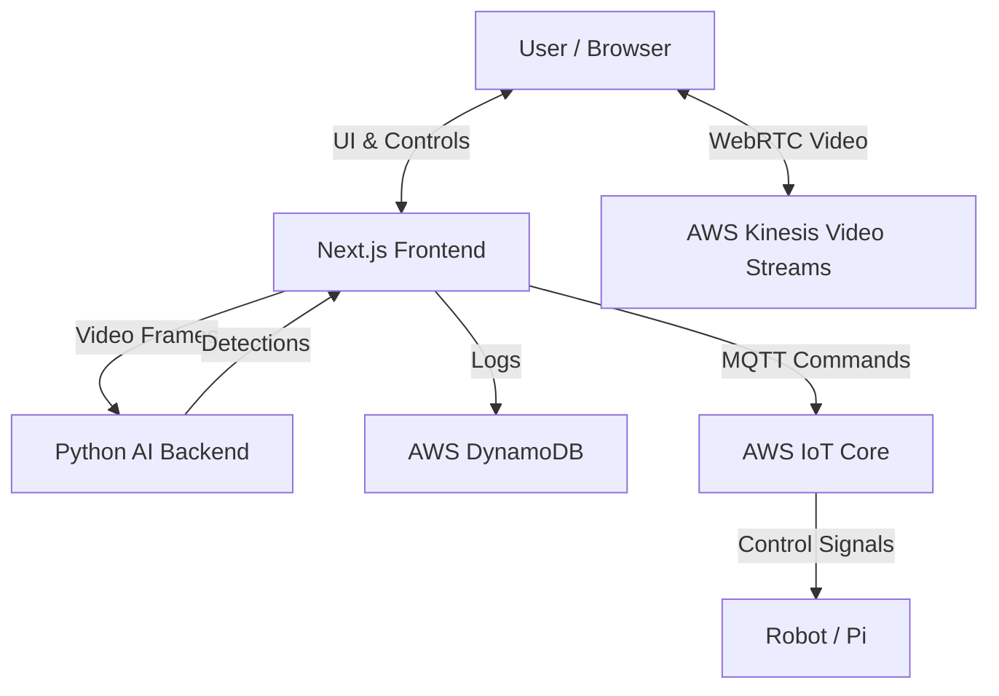

# 🤖 PiBot Control Dashboard

A high-performance, real-time control interface for remote robotics, featuring low-latency video streaming, AI-powered object detection, and precise telemetry monitoring.


## ✨ Features

- **🎮 Real-time Control**: Smooth, low-latency joystick control for movement and camera systems.
- **👁️ AI Object Detection**: 
  - **Server-side Processing**: Python/FastAPI backend running TensorFlow SSD MobileNet.
  - **Zero-Latency UI**: Detection runs off the main thread, ensuring 60fps UI performance.
  - **Visual Feedback**: Bounding boxes and confidence scores overlaid on the video stream.
- **📹 Live Streaming**: WebRTC integration via AWS Kinesis Video Streams (KVS).
- **📊 Telemetry & Logging**:
  - Real-time CPU load, signal strength, and latency monitoring.
  - Persistent detection logs stored in AWS DynamoDB.
  - Live system activity console.
- **🎨 Modern UI/UX**:
  - Fully responsive design (100vh layout without scrolling).
  - Dark/Light mode support with distinct, pro-grade color palettes.
  - Glassmorphism effects and smooth animations.

## 🏗️ Architecture

The project consists of two main components:

1.  **Frontend (Next.js 14)**: Handles the UI, WebRTC streaming, and control logic.
2.  **Backend (Python/FastAPI)**: dedicated microservice for running heavy TensorFlow models.



## 🚀 Getting Started

### Prerequisites

- **Node.js**: v18+
- **Python**: v3.9+
- **AWS Account**: With configured KVS, DynamoDB, and IoT Core.

### 1. Environment Setup

Create a `.env` file in the root directory:

```env
# AWS Configuration
NEXT_PUBLIC_AWS_REGION=us-east-1
NEXT_PUBLIC_AWS_ACCESS_KEY_ID=your_access_key
NEXT_PUBLIC_AWS_SECRET_ACCESS_KEY=your_secret_key

# Services
NEXT_PUBLIC_KVS_CHANNEL_NAME=your_channel_name
NEXT_PUBLIC_IOT_ENDPOINT=your_iot_endpoint
DYNAMODB_TABLE_NAME=your_table_name
```

### 2. Backend Setup (Object Detection)

The Python backend handles the heavy lifting for AI detection.

```bash
cd backend

# Create virtual environment
python -m venv venv

# Activate (Windows)
.\venv\Scripts\activate

# Activate (Mac/Linux)
source venv/bin/activate

# Install dependencies
pip install -r requirements.txt

# Start the server (Runs on port 8000)
uvicorn main:app --reload --port 8000
```

### 3. Frontend Setup

Run the dashboard interface.

```bash
# Install dependencies
npm install

# Start development server (Runs on port 3000)
npm run dev
```

## 🎮 Usage

1.  Open `http://localhost:3000` in your browser.
2.  Ensure the **Python Backend** is running (Indicator should show "AI (Connected)").
3.  Use the **Joystick** to control the robot.
4.  View real-time detections overlaid on the video stream.
5.  Check the **Syslog** panel for connection status and detection history.

## 🛠️ Tech Stack

- **Frontend**: Next.js 14, React, TailwindCSS, Lucide Icons.
- **Backend**: FastAPI, TensorFlow, NumPy, Pillow.
- **Cloud (AWS)**: Kinesis Video Streams, DynamoDB, IoT Core.
- **Communication**: WebRTC, MQTT (via AWS IoT), REST API.

## 📄 License

This project is licensed under the MIT License.
